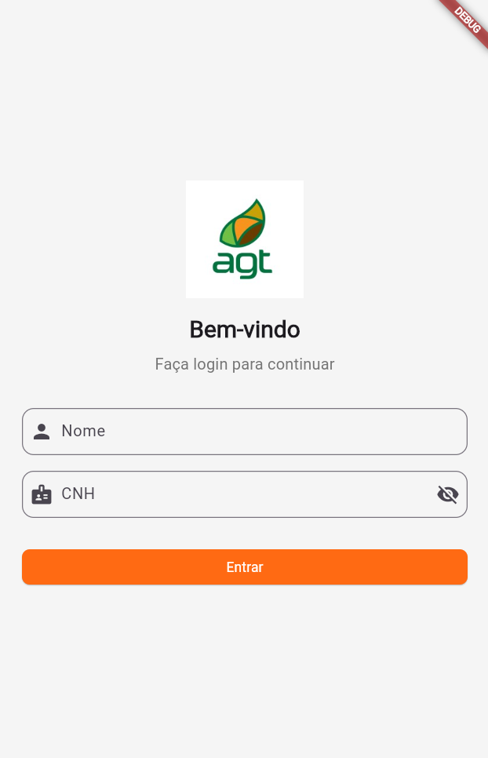
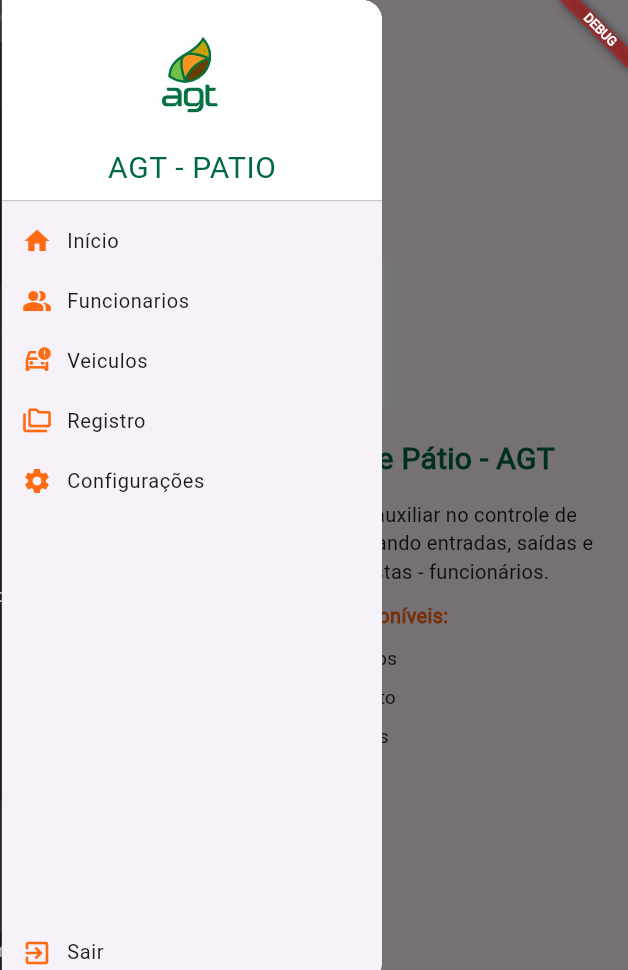

# Projeto Portaria - README

## Estrutura MVVM

Foi a primeira vez que utilizei essa arquitetura e gostei bastante. Separar a regra de negócios das funções de UI é a melhor estrutura que utilizei até o momento.

## Pasta `url`

Contém um arquivo com uma classe abstrata com as URLs, para que, quando precisar mudar alguma coisa, altere apenas lá.

## Maior desafio

Foi começar a consumir a API, mas depois que descobri o problema de Cross-Origin, todos os meus problemas acabaram. A partir daí, foi só seguir.
Tive dificuldade em entender um pouco da estrutura MVVM, mas depois que fiz e entendi o que fiz, ficou muito prazeroso construir esse projeto.

## Pontos a evoluir

Existem algumas coisas que ainda não entendi, pois não cheguei a usar, como, por exemplo, a pasta `constants`. Não me aprofundei nela para conseguir terminar a tempo, mas, sem dúvida, vou dar continuidade nos estudos dessa estrutura.

## Experiência prévia

Já trabalhei bastante com Flutter. As Entities e Models criei junto com o site [json\_to\_dart](https://javiercbk.github.io/json_to_dart/) para não precisar criar tudo manualmente. Utilizei o chat para validar se estava correto ou não. Tive problema com ID uma vez.

Os Datasources foram muito bons — estava acostumado a utilizar apenas Repository para escrever regra e conexão com banco, então essa divisão foi bem satisfatória.

## UI

Construi toda a UI da minha cabeça, utilizei uma logo da AGT e a paleta de cores do site [AGT](https://www.agroterenas.com.br/).

---

## Observações finais

Sou novo na programação, mas muito empenhado nos estudos e completamente fissurado em programar!
Desculpa qualquer commit com erro, estou disposto a receber qualquer crítica!

---

## Projeto

Para o desenvolvimento, utilizei as seguintes dependências no `pubspec.yaml`:

* `cupertino_icons: ^1.0.8`
* `provider: ^6.1.3`
* `dio: ^5.1.0`
* `jwt_decoder: ^2.0.1`
* `intl: ^0.18.1`

Usei o **VSCode** como editor de código e o navegador **Chrome** para buildar e testar o projeto.

---

## Telas do Projeto

### Tela Login

### Drawer

### Tela Home

### Tela Funcionários

### Tela Veículos

### Tela Registro

---